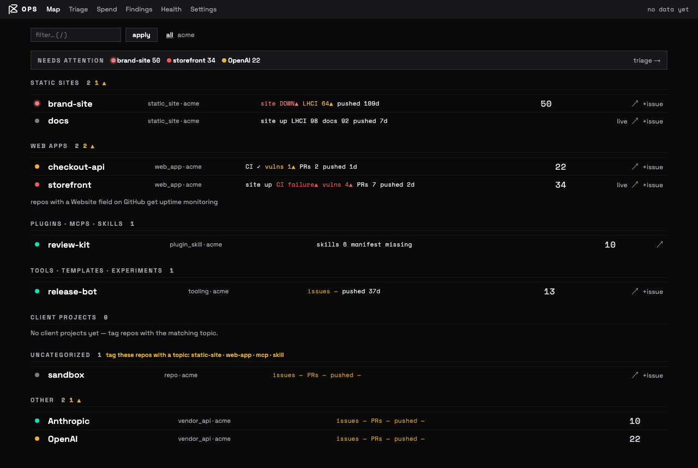
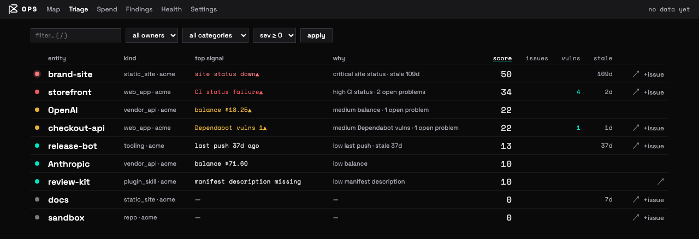
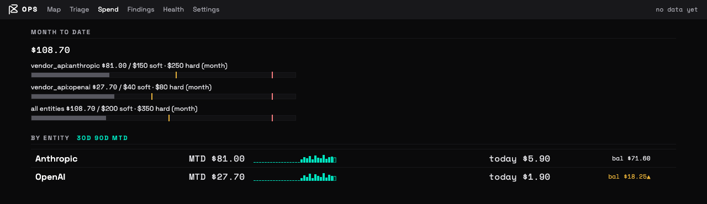
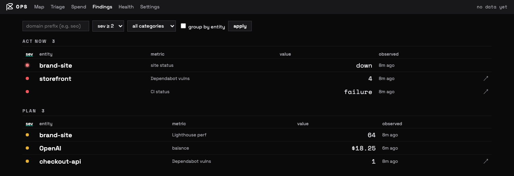
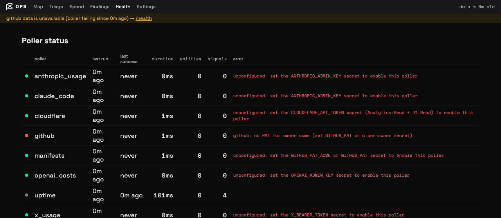

# Ops

A read-mostly aggregation dashboard for a portfolio of dev projects, running on
Cloudflare Workers + D1. It answers two questions you otherwise answer by
opening fifteen browser tabs:

1. **What is this costing me?** — token and usage spend across AI/API vendors,
   measured against budgets you set.
2. **What needs attention?** — every repo, plugin, skill and vendor account
   ranked by how much trouble it is in, deep-linked to the real system of record.

The guiding rule is **read here, act there**. Ops never writes to GitHub or
anywhere else; the only write-shaped affordance in the whole UI is a pre-filled
new-issue link. It is a lens over other systems, not another system of record
([ADR-001](docs/adr/001-read-mostly-system-of-record.md)).



## Why this exists

If you keep more than a handful of side projects alive, the state you care about
is smeared across GitHub Actions, Dependabot, Lighthouse, uptime checks, and
half a dozen billing consoles. None of them know about each other, and none of
them can tell you "the brand site has been down for a week and you haven't
pushed to it in 109 days."

Ops pulls those signals into one table, scores them, and sorts by what is
actually worth your next hour.

## The four views

**Triage** ranks everything by a transparent score, and every score explains
itself in the `why` column — no black-box ordering.



**Spend** tracks consumptive cost against soft and hard budgets, with
period-correct math (the bars share the budget evaluator's logic rather than
approximating month-to-date).



**Findings** is the flat, filterable severity feed across every metric domain —
split into "act now" and "plan".



**Map** (the first screenshot) is the portfolio overview, grouped by category,
with an attention rail across the top. **Health** and **Settings** round it out:
per-poller status with error text, and budget/weight configuration.

## How it works

```
cron ──► pollers ──► signals (append-only) ──► derive ──► views
             ▲                                    │
   POST /ingest (CI)                          budgets, hygiene,
                                              anomalies, scores
```

- **Entities** are the things you track: `repo:owner/name`, `plugin:owner/name`,
  `vendor_api:anthropic`. Identified by `{kind}:{natural_key}`.
- **Signals** are timestamped observations about an entity — `ci.status`,
  `deps.vuln_count`, `spend.usd`, `site.up`. They are append-only and
  deduplicated on `(entity_id, metric, dedupe_key)`
  ([ADR-002](docs/adr/002-append-only-signals.md)), so history is queryable and
  a re-run is idempotent.
- **Metrics are namespaced** `domain.name`. This is the extension point: push a
  signal with a brand-new domain like `seo.crawl_errors` and it shows up on
  `/findings` with zero code changes, filterable by `?domain=seo`.
- **Pollers** are a static array ([ADR-003](docs/adr/003-static-poller-array.md))
  that run on cron. A failing poller is recorded as a signal rather than
  crashing the run, so one dead upstream degrades the page instead of the app.

Everything else — budget breaches, spend anomalies, hygiene gaps like "this repo
has no category tag" — is *derived* from stored signals on each pass, not stored
as separate truth.

## Bundled pollers

| Poller | Schedule | Needs | Reports |
|---|---|---|---|
| `github` | hourly | `GITHUB_OWNERS`, `GITHUB_PAT` | CI status, Dependabot vulns, open PRs/issues, last push, releases, branches |
| `uptime` | hourly | — (uses each repo's GitHub Website field) | `site.up`, `site.response_ms` |
| `anthropic_usage` | daily | `ANTHROPIC_ADMIN_KEY` | token spend and usage |
| `claude_code` | daily | `ANTHROPIC_ADMIN_KEY` | sessions, lines added, commits |
| `openai_costs` | daily | `OPENAI_ADMIN_KEY` | organization costs |
| `x_usage` | daily | `X_BEARER_TOKEN` | monthly post cap usage |
| `cloudflare` | daily | `CLOUDFLARE_API_TOKEN`, `CF_ACCOUNT_ID` | Worker requests/errors, D1 size |
| `manifests` | daily | `MARKETPLACE_REPO`, `GITHUB_PAT` | Claude Code plugin/skill inventory |

A poller whose credential is absent reports itself as **unconfigured** — a calm
state listed on `/health` at low severity, distinct from a real failure and
deliberately not enough to trip the degradation banner. So you can start with
just `GITHUB_PAT` and add vendors later without the dashboard crying wolf.



Ops monitors itself with its own machinery: each poller run is recorded as a
signal on a synthetic `poller:{id}` entity, so "the thing that watches the
things" is visible in the same table as everything else.

## Configuration

Split by sensitivity. **Vars** are non-secret deployment config and live in
`wrangler.jsonc`; **secrets** never touch the repo
([ADR-004](docs/adr/004-public-shell-private-config.md)).

**Vars** (`wrangler.jsonc` — replace all of these when you fork):

| Var | Meaning |
|---|---|
| `GITHUB_OWNERS` | comma-separated users/orgs to scan |
| `OPS_URL` | the deployment's own URL, used for notification deep links |
| `CF_ACCOUNT_ID` | account whose Worker/D1 analytics to read |
| `MARKETPLACE_REPO` | `owner/repo` of a plugin marketplace; omit to disable `manifests` |

**Secrets** (`wrangler secret put <NAME>`), all optional:

| Secret | Enables |
|---|---|
| `GITHUB_PAT` | the `github` and `manifests` pollers |
| `GITHUB_PAT_<OWNER>` | per-owner override — see below |
| `ANTHROPIC_ADMIN_KEY` | `anthropic_usage`, `claude_code` |
| `OPENAI_ADMIN_KEY` | `openai_costs` |
| `X_BEARER_TOKEN` | `x_usage` |
| `CLOUDFLARE_API_TOKEN` | `cloudflare` — scope it read-only (Account Analytics:Read + D1:Read), never the Global key |
| `INGEST_TOKEN` | `POST /ingest` — without it the endpoint returns 503 |
| `NTFY_URL` | push notifications for new high-severity findings |
| `NTFY_TOKEN` | auth for a protected ntfy topic |

GitHub fine-grained PATs are scoped to a single resource owner. With multiple
owners in `GITHUB_OWNERS`, set one secret per owner: `GITHUB_PAT_<OWNER>`
(uppercased, non-alphanumerics become `_`, e.g. `GITHUB_PAT_ACME`). `GITHUB_PAT`
is the fallback for any owner without an override.

## Deploying

```sh
npm install
wrangler d1 create ops                        # put the returned id in wrangler.jsonc
wrangler d1 migrations apply ops --remote
wrangler secret put GITHUB_PAT
wrangler deploy
```

Then edit the `vars` block in `wrangler.jsonc` to point at your own owners and
account, and redeploy.

### Access control

**Ops has no application-level login. Put [Cloudflare
Access](https://developers.cloudflare.com/cloudflare-one/policies/access/) in
front of the Worker before you put anything real in it.** The dashboard assumes
every reader is you.

Two things are enforced in the app itself as defense-in-depth, so a
misconfigured Access policy is not instantly catastrophic:

- **Same-origin gate.** Every state-mutating `POST` requires an `Origin` header
  matching the deployment. That blocks cross-site request forgery and, because
  non-browser clients send no `Origin` at all, anonymous `curl` against the
  write routes — including `/health/run`, which fans out to every upstream API.
- **`POST /ingest` is exempt and carries its own bearer token**, compared in
  constant time, so CI can push through an Access service token or a bypass
  policy for that one path.

## Pushing signals from CI

Any pipeline can contribute signals. Set `INGEST_TOKEN`, then as the final step:

```sh
curl -X POST "$OPS_URL/ingest" \
  -H "Authorization: Bearer $OPS_INGEST_TOKEN" \
  -H "Content-Type: application/json" \
  -d '{
    "entities": [{ "id": "repo:me/site", "kind": "repo", "name": "site", "category": "static_site" }],
    "signals": [{
      "entityId": "repo:me/site",
      "metric": "lhci.performance",
      "valueNum": 97,
      "severity": 0,
      "observedAt": '"$(date +%s)"',
      "url": "'"$GITHUB_SERVER_URL/$GITHUB_REPOSITORY/actions/runs/$GITHUB_RUN_ID"'",
      "dedupeKey": "'"$GITHUB_RUN_ID"'"
    }]
  }'
```

**Signal fields.** `entityId`, `metric`, `observedAt` (epoch seconds) and
`dedupeKey` are required. `valueNum`, `valueText`, `url` and `severity` (`0`–`4`,
default `0`) are optional. For a metric covering a time window rather than an
instant, add `period: { "start": <epoch>, "end": <epoch> }` — that is what makes
spend roll up correctly. Unknown fields are ignored, and `metric` must match
`^[a-z0-9_]+\.[a-z0-9_.]+$`.

Signals referencing an entity Ops has never seen are rejected, so include the
entity in the same request (upserts are idempotent).

## Development

```sh
npm run dev        # local dev server against local D1
npm test           # vitest against real workerd
npm run typecheck
```

To seed a local instance, apply migrations with
`wrangler d1 migrations apply ops --local`, put `INGEST_TOKEN=dev-token` in
`.dev.vars`, and POST the payload above at `http://localhost:8787/ingest`.

### Adding a poller

Implement the `Poller` interface in `src/pollers/`, then add it to the array in
[`src/pollers/index.ts`](src/pollers/index.ts). Return entities and signals;
the runner handles storage, dedup, failure isolation and health reporting.
Read its credential from `env` and return an empty result when it is missing,
so the poller stays dormant rather than erroring on every run.

## Design notes

The architecture decisions, with their alternatives and trade-offs, are in
[`docs/adr/`](docs/adr/). Longer-form design docs:

- [ops-spec.md](ops-spec.md) — architecture, data model, poller interface
- [ops-ux.md](ops-ux.md) — pages, URLs, states
- [ops-plan.md](ops-plan.md) — implementation phases

Stack: [Hono](https://hono.dev) with JSX server rendering,
[htmx](https://htmx.org) for partial updates, D1 for storage. No client-side
framework and no build step for the UI.

## License

MIT — see [LICENSE](LICENSE).
